<!-- Animated GitHub Contribution Graph -->

<h3><code>VISHESH-53@github ~ $ ./contributions.sh</code></h3>

  

<!-- ASCII Portrait + Info Card -->

<h3><code>VISHESH-53@github ~ $ whoami</code></h3>

<table>
<tr>
<td valign="top">

</td>

<td valign="top">

</td>
</tr>
</table>

  

<!-- Links -->

<h3><code>VISHESH-53@github ~ $ ./links.sh</code></h3>

<b>Software Engineer • AI Engineer • Competitive Programmer</b>

